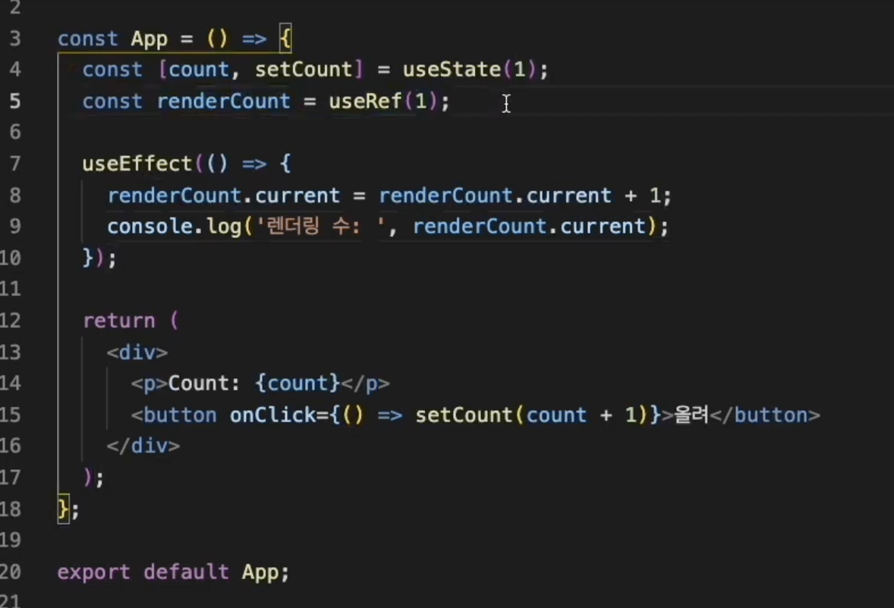

# 🩵 useRef

<br>

https://www.youtube.com/watch?v=VxqZrL4FLz8&list=PLZ5oZ2KmQEYjwhSxjB_74PoU6pmFzgVMO&index=3

<br>

## useRef

```jsx
const ref = useRef(value);
```

- ref 라는 객체를 반환한다.
  - ref 객체 안에는 `{ current: value }` 가 기본적으로 들어있다.
  - 컴포넌트가 언마운트 되기 전까지는 계속 ref.current 값이 유지가된다.

<br>

## Ref는 언제 사용될까?

1. **어떠한 값을 저장해두는 저장공간으로 사용된다.**
   1. State 변화가 있을때 컴포넌트가 렌더링 되면서 모든 내부 변수들이 초기화되는데 ref에 있는 값은 변화하지 않고 유지된다.
   2. state의 변화가 있어도 컴포넌트가 렌더링 되는데 ref 값은 유지된다.
   3. 절대 변하지 않을 변수를 저장할 때 사용하면 좋다.

<br>

2. **돔 요소에 접근할 수 있다.**
   1. 만약 로그인페이지에 들어갔을 때 ID를 입력하는 input에 focus() 하고 싶을 때 사용할 수 있다.
   2. 자바스크립트에서 `Document.querySelector()` 과 동일한 역할을 한다.

<br>

## useRef 와 useState 차이점

**useRef의 가장 중요한 점은 state가 변하든, ref 값이 변하든 컴포넌트가 렌더링 되지 않아 화면상으로 표시 되지 않습니다!! state는 바뀔때마다 렌더링!!**

```jsx
const ref = useRef(0); // ref.current 에 0 이 담김

const increaseCount = () => {
  ref.current = ref.current + 1;
};
```

버튼 클릭시 increaseCount 함수를 통해서 ref.current 값을 증가시킨다고 했을때 화면에 바로 렌더링되면서 1, 2, 3, .. 숫자로 나타나지 않는다.

하지만 값이 증가하고 있다는 것!!! 콘솔로 찍어보면 값은 증가하고 있다.

증가시켜놓고 렌더링 되도록 하면 증가해둔 숫자가 나타난다.

useState 로 설정해둔 값은 컴포넌트가 계~속 렌더링되면서 화면에 값이 바뀌는게 잘 보임!

<br>

## useRef 와 변수의 차이점

```jsx
const ref = useRef(0);
const countVar = 0;
```

변수와 ref 모두 증가 함수를 만들어서 숫자를 증가시킨다고 해서 화면에 바로 노출되지 않습니다.

두개 모두 렌더링 시키는 애들은 아니기때문에!!

하지만 요것도 콘솔창에서 확인해보면 값은 두개 모두 증가하고 있습니다.

<br>

차이점은!!

증가함수를 통해서 ref, countRef 두개 모두 3까지 증가시켜놓은 상태에서 컴포넌트를 렌더링 시켰다고 가정해보자!

그때서야 변경된 값이 화면에 노출되도록 해준다면, 렌더링시킬때 증가된 값이 나타날 것이다.

<br>

그러고 다시 증가 함수를 사용해서 두 변수 각각 2번 더 증가시켰다고 가정해보자!

**그럼 ref 는 기존 것을 렌더링해도 변경하지 않고 유지하기 때문에 3 다음부터인 4, 5 까지 증가될 것이고,**

**변수는 컴포넌트가 렌더링되면 값이 초기화 됩니다.**

그렇기 때문에 변수는 다시 0 부터 시작해서 두 번 클릭 했으니 다시 2로 노출되게 됩니다.

<br>

- ref : 0 → 증가 + 3(화면상으로 노출안됨) → 컴포넌트 렌더링 → 3 → 다시 증가 + 2 → 컴포넌트 렌더링 → 5

- countVar : 0 → 증가 + 3(화면상으로 노출안됨) → 컴포넌트 렌더링 → 3 → 다시 증가 + 2 → 컴포넌트 렌더링 → 2
  - 렌더링 하게되면 값은 다시 초기화 0부터 다시 시작됨

<br>

## useRef의 유용함을 알 수 있는 예시



올려 버튼을 누르면 setCount 가 변경되면서 App 컴포넌트가 렌더링 됩니다.

그러면서 useEffect가 실행되는데!!!

만약 useEffect 함수 안에서 useRef를 쓰지 않고 useState를 써서 또 어떠한 다른 상태를 변경하고 있다면!

그게 또 렌더링을 일으키게 되면서 컴포넌트의 무한 렌더링이 되면서 에러가 와라라랅 납니다.

<br>

useRef를 써서 renderCounter.current 값을 증가시키면 렌더링을 일으키지는 않기때문에

값은 증가되고 렌더링은 되지않아 각각의 값을 업데이트를 깔~끔하게 시켜줍니다👍👍

<br>

## 변화는 감지해야하지만, 그 변화가 렌더링을 발생시키면 안되는 어떠한 값을 다룰때 쓰면 Good!!!

<br>

<hr>

## useRef로 DOM 요소 접근하기

ex) 로그인 페이지에 진입시 Input text 요소에 자동으로 focus() 될 수 있도록 하기

```jsx
improt React, { useEffect, useRef} from 'react';

const App = () => {
  const inputRef = useRef();

  useEffect(() => {
    console.log(inputRef); // inputRef.current 값인 input 의 정보가 모두 출력된다.
    inputRef.current.focus();
  }, [])

  return(
    <div>
      <input ref={inputRef} type="text" placeholder="username" />
      <button>로그인</button>
    </div>
  )
}
```

- useRef()
- useEffect() 맨 처음 렌더링 될 때 실행하기 위한 함수
  - console.log(inputRef) 하면
  - current : input 이 되고!
  - current 안에 Input의 정보가 모두 들어가 있음
  - `inputRef.current.focus();`
- input ref={inputRef} 인풋에 대한 참조
